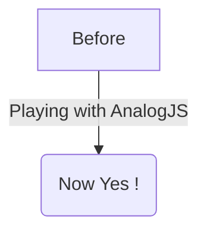

# First Post

This is the first post in the blog.


```html
<div>
    <h1>HTML Code</h1>
</div>
```

```css
body {
    background-color: #f0f0f0;
}
```

```javascript
console.log('Hello World');
```
Hello, do you know Mermaid ?

You can quickly create and edit diagrams with in markdown !

This following raw code block

````

````

Will be rendered as:

